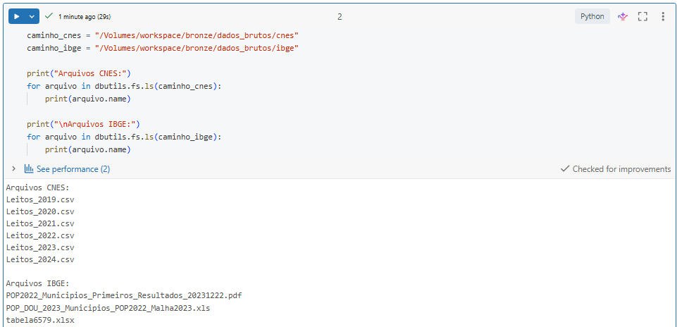
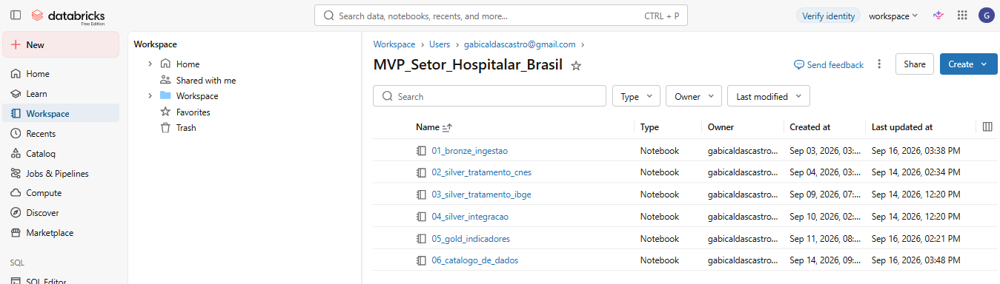
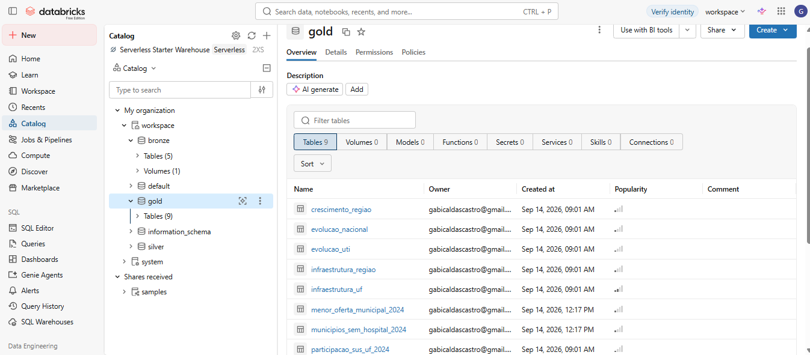
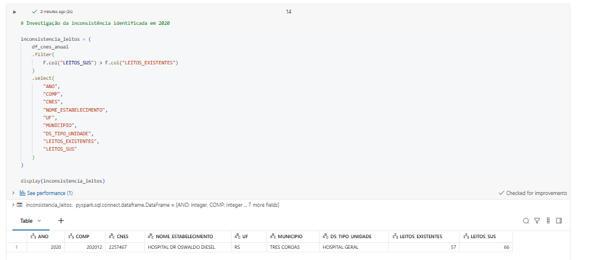
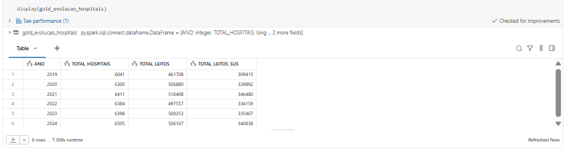
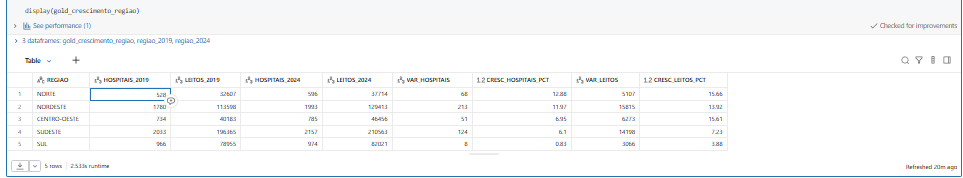
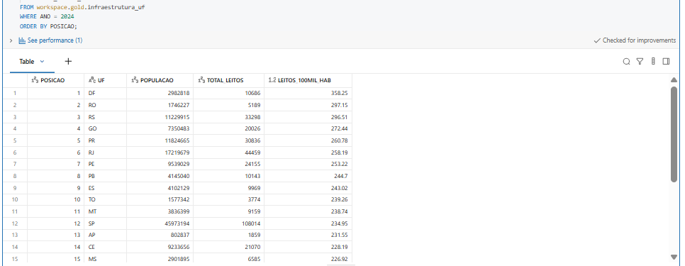
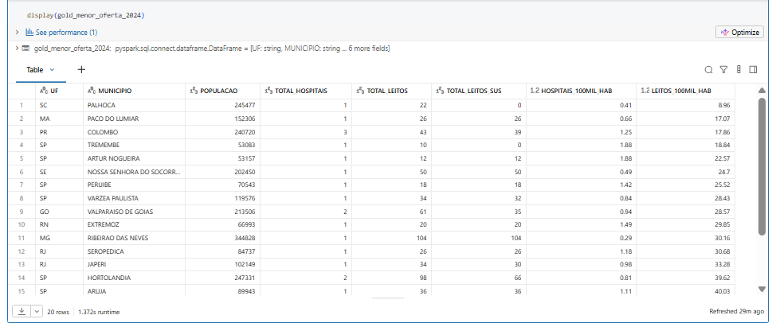

## Contexto de Negócio e Perguntas

A ideia deste projeto surgiu a partir de uma curiosidade sobre a expansão dos serviços físicos. Hoje, muitos setores conseguem reduzir sua presença física à medida que os serviços migram para o ambiente digital. No setor da saúde, porém, essa dinâmica é diferente. Mesmo com o crescimento da telemedicina e dos atendimentos online, boa parte da assistência ainda depende de uma estrutura física, como hospitais, leitos e unidades de atendimento.

Por atuar na área da saúde, esse cenário despertou meu interesse em entender o que vinha acontecendo com a infraestrutura hospitalar no Brasil. A partir disso, surgiu a proposta de analisar como hospitais e leitos estão distribuídos pelo país e como essa oferta se modificou ao longo dos últimos anos.

O objetivo do projeto foi analisar a distribuição e a evolução da infraestrutura hospitalar brasileira entre 2019 e 2024, relacionando os dados hospitalares com a população de cada localidade.

### Perguntas do projeto

A análise foi orientada pelas seguintes perguntas:

- Onde está concentrada a infraestrutura hospitalar no Brasil?
- Quais estados e regiões apresentaram maior crescimento da oferta hospitalar?
- Como o número de estabelecimentos hospitalares evoluiu entre 2019 e 2024?
- Como a quantidade de leitos existentes e leitos SUS evoluiu nesse período?
- Como a oferta de leitos se relaciona com o tamanho da população?
- Quais estados ou municípios apresentam maior ou menor oferta de leitos por 100 mil habitantes?
- Quais localidades apresentam sinais de menor oferta relativa de infraestrutura hospitalar e podem indicar pontos que merecem uma investigação mais aprofundada?

O projeto analisa a oferta de infraestrutura hospitalar. Por isso, uma menor quantidade de leitos por habitante é interpretada como um sinal de menor oferta relativa e não, isoladamente, como falta de atendimento, já que fatores como demanda, ocupação dos leitos e deslocamento de pacientes não fazem parte desta análise.

### Fontes de dados

Para responder às perguntas do projeto, foram utilizadas duas fontes públicas de dados:

**CNES/DATASUS — Hospitais e Leitos**

Foram utilizados os arquivos anuais de Hospitais e Leitos do CNES, de 2019 a 2024. A base possui registros por competência mensal e contém informações sobre os estabelecimentos de saúde, localização, tipo de unidade, quantidade de leitos existentes, leitos SUS e leitos de UTI.

**IBGE — População dos Municípios**

Os dados populacionais foram utilizados para relacionar a infraestrutura hospitalar com o tamanho da população e permitir a construção de indicadores por 100 mil habitantes. Foram utilizadas informações municipais correspondentes ao período de 2019 a 2024.

Os arquivos do IBGE apresentavam formatos diferentes entre os anos. Por isso, foi necessário trabalhar com a Tabela 6579 para 2019, 2020, 2021 e 2024, além dos arquivos específicos utilizados para 2022 e 2023.

### Mudança no escopo inicial

Inicialmente, o projeto também previa a utilização de dados de produção hospitalar do SIH/SUS, com o objetivo de analisar não apenas a oferta, mas também a utilização da infraestrutura hospitalar.

Durante a etapa de coleta, essa fonte se mostrou muito mais extensa e fragmentada do que o previsto, com arquivos mensais que aumentariam bastante a complexidade do pipeline para o escopo deste MVP. Por esse motivo, optei por manter o projeto concentrado na análise da oferta de infraestrutura, utilizando CNES e IBGE.

Essa decisão também definiu o limite da análise: os resultados permitem observar a presença e a oferta relativa de hospitais e leitos, mas não medir sua utilização ou a demanda pelos serviços.

Os dados utilizados são de acesso público e foram obtidos em fontes oficiais do Governo Federal, por meio do DATASUS/CNES e do IBGE. As fontes originais foram identificadas e mantidas na documentação do projeto.

## Carga dos Dados

Os arquivos utilizados no projeto foram baixados das fontes oficiais e enviados para o Databricks. Os dados brutos foram armazenados em um Volume, separados em pastas para CNES e IBGE.

A ingestão foi organizada no notebook `01_ingestao_bronze.py`. Nessa etapa, os arquivos foram lidos e persistidos em tabelas Delta na camada Bronze, mantendo o formato e a estrutura das fontes o mais próximo possível do original.

No CNES, os arquivos de 2019 a 2022 e de 2023 a 2024 foram mantidos em tabelas separadas porque apresentavam diferenças na nomenclatura das colunas. Já os dados do IBGE vieram em formatos diferentes entre os anos, incluindo XLSX, XLS e PDF, e por isso também foram ingeridos separadamente antes da padronização realizada na camada Silver.

O código completo desta etapa está disponível no notebook `01_ingestao_bronze.py`, na pasta `notebooks` deste repositório.

### Evidência da carga dos dados

A imagem abaixo mostra os arquivos do CNES e do IBGE armazenados no Volume utilizado no projeto.

## Modelagem e Catálogo de Dados

Para organizar os dados, optei por uma modelagem Flat por conceito, utilizando a arquitetura em camadas Bronze, Silver e Gold.

Escolhi esse modelo porque o objetivo do projeto não era construir um Data Warehouse com uma tabela fato e várias dimensões, mas preparar e integrar duas fontes diferentes para gerar tabelas voltadas às análises propostas. Para este MVP, essa estrutura deixou o pipeline mais simples de acompanhar e facilitou a separação entre os dados brutos, os tratamentos e os indicadores finais.

### Organização das camadas

**Bronze**

Nesta camada foram mantidos os dados das fontes originais. Os arquivos do CNES e do IBGE foram ingeridos e persistidos em tabelas Delta, preservando inclusive diferenças de estrutura encontradas entre os arquivos.

**Silver**

Na camada Silver foram realizados os tratamentos e a integração dos dados. Os layouts do CNES foram padronizados, os dados populacionais do IBGE foram organizados em uma estrutura única e, posteriormente, as duas fontes foram integradas.

Um ponto importante dessa etapa foi a integração dos municípios. Como o CNES não possuía o mesmo código municipal utilizado na base populacional, inicialmente foi criada uma chave a partir do nome do município e da UF. Após a identificação das correspondências entre as fontes, o código oficial do município no IBGE passou a ser utilizado como chave estável para a integração por ano.

**Gold**

A camada Gold foi construída para concentrar as tabelas utilizadas diretamente nas análises. Foram criados indicadores nacionais, regionais, estaduais e municipais, além das análises de evolução dos hospitais, leitos, UTIs e participação dos leitos SUS.

### Catalogo de Dados

O catálogo foi construído para documentar as nove tabelas analíticas da camada Gold. Para cada tabela foram registrados o contexto, os campos, tipos de dados, chaves lógicas, domínios observados e a linhagem dos dados.

O catálogo completo pode ser consultado no arquivo [CATALOGO_DADOS.md](CATALOGO_DADOS.md).

## Pipeline de Dados

O pipeline foi desenvolvido no Databricks e dividido em notebooks para separar as principais etapas do processo, desde a ingestão dos dados até a construção dos indicadores e do catálogo de dados.

Os notebooks estão disponíveis na pasta [notebooks](notebooks/).

As tabelas intermediárias e finais foram persistidas em formato Delta no Databricks, nos schemas `bronze`, `silver` e `gold`.

### Persistencia das tabelas

As tabelas resultantes do pipeline foram persistidas no Databricks em formato Delta. A imagem abaixo apresenta as tabelas analíticas da camada Gold disponíveis no catálogo.

## Qualidade de Dados

A qualidade dos dados foi verificada ao longo das etapas de tratamento, considerando valores nulos, duplicidades, tipos de dados, valores inválidos e consistência das chaves utilizadas na integração.

No CNES, após a seleção da competência de dezembro como referência anual, foi validada a chave `ANO + CNES`, sem duplicidades na tabela final. Também foram verificados valores negativos nos campos de leitos, não sendo encontrados registros nessa condição.

Foi identificada uma inconsistência em um registro de 2020, no qual a quantidade de leitos SUS era superior à quantidade de leitos existentes. Como não havia informação suficiente para determinar qual valor estava incorreto, o registro foi mantido conforme a fonte original, sem alteração dos valores.

Nos dados do IBGE, foram tratados registros administrativos, valores populacionais não numéricos e diferenças de formato entre os anos. A tabela municipal final ficou com 5.570 municípios em cada ano analisado, sem duplicidades na chave `ANO + COD_MUNICIPIO`, valores nulos ou populações não positivas.

Na integração entre CNES e IBGE, também foram identificadas diferenças na nomenclatura de alguns municípios. Essas ocorrências foram verificadas e tratadas por meio de equivalências controladas antes da adoção do código oficial do município como chave para a integração temporal.

As validações detalhadas estão disponíveis nos notebooks da pasta [notebooks](notebooks/).

## Análise de Dados

A partir das tabelas da camada Gold, foram realizadas consultas em SQL para responder às perguntas definidas no início do projeto. A análise considera a evolução da infraestrutura hospitalar entre 2019 e 2024 e sua distribuição pelo território brasileiro.

### Evolução da infraestrutura hospitalar

Entre 2019 e 2024, o número de hospitais passou de 6.041 para 6.505, enquanto o total de leitos passou de 461.708 para 506.167. Os dados mostram crescimento da infraestrutura hospitalar no período analisado.

A quantidade de leitos SUS também permaneceu representativa durante todo o período, correspondendo a aproximadamente dois terços dos leitos existentes.

### Crescimento por região

O crescimento não ocorreu da mesma forma em todas as regiões. Entre 2019 e 2024, o Norte apresentou o maior crescimento percentual no número de leitos, com 15,66%, seguido de perto pelo Centro-Oeste, com 15,61%.

Em números absolutos, o Nordeste apresentou o maior aumento, com 15.815 novos leitos no período.

### Oferta de leitos em relação à população

Para comparar localidades com populações diferentes, foi utilizado o indicador de leitos por 100 mil habitantes.

Em 2024, o Distrito Federal apresentou a maior oferta relativa entre as UFs, com 358,25 leitos por 100 mil habitantes. No outro extremo, Sergipe apresentou 162,81 leitos por 100 mil habitantes.

Essa diferença mostra que a distribuição da infraestrutura hospitalar não acompanha a população da mesma forma em todas as unidades da federação.

### Análise municipal

Para o ranking de menor oferta relativa, foram considerados municípios com 50 mil ou mais habitantes e com presença de Hospital Geral ou Hospital Especializado no recorte adotado. Esse filtro foi utilizado para reduzir distorções provocadas por taxas calculadas sobre populações muito pequenas.

Entre os municípios analisados, foram encontradas diferenças importantes na quantidade de leitos disponíveis em relação ao tamanho da população. Palhoça (SC), por exemplo, apresentou 8,96 leitos por 100 mil habitantes no recorte analisado.

A análise permitiu identificar localidades com menor oferta relativa de infraestrutura, que podem ser investigadas com maior profundidade. No entanto, como este MVP analisa a oferta e não a utilização dos serviços, esses resultados não são suficientes, isoladamente, para afirmar que existe demanda por novos hospitais em determinada localidade.

A análise de utilização estava prevista inicialmente por meio dos dados de produção hospitalar do SIH/SUS, mas essa fonte foi retirada do escopo durante a etapa de coleta devido ao volume e à fragmentação dos arquivos. Sua inclusão em uma continuidade do projeto permitiria confrontar a infraestrutura disponível com a utilização dos serviços hospitalares.

## Autoavaliação

Considero que os principais objetivos propostos para o MVP foram alcançados. Foi possível construir um pipeline completo, desde a ingestão e tratamento dos dados até a integração das fontes, criação dos indicadores e análise dos resultados.

A maior dificuldade do projeto esteve na preparação e integração das bases. Os dados do IBGE vieram em formatos diferentes entre os anos e a ausência de uma chave municipal comum com o CNES exigiu um tratamento maior do que eu havia previsto inicialmente. Também foi necessário rever o escopo ao perceber que a inclusão do SIH/SUS tornaria o projeto muito mais extenso para o prazo disponível.

Este foi meu primeiro projeto utilizando Databricks, e uma parte importante do aprendizado foi entender na prática a organização das camadas Bronze, Silver e Gold, a persistência em tabelas Delta e a importância das etapas de validação antes de realizar as análises.

Como continuidade, gostaria de incluir os dados de utilização hospitalar do SIH/SUS. Isso permitiria avançar da análise da oferta de infraestrutura para uma comparação entre a estrutura disponível e a utilização dos serviços hospitalares.
